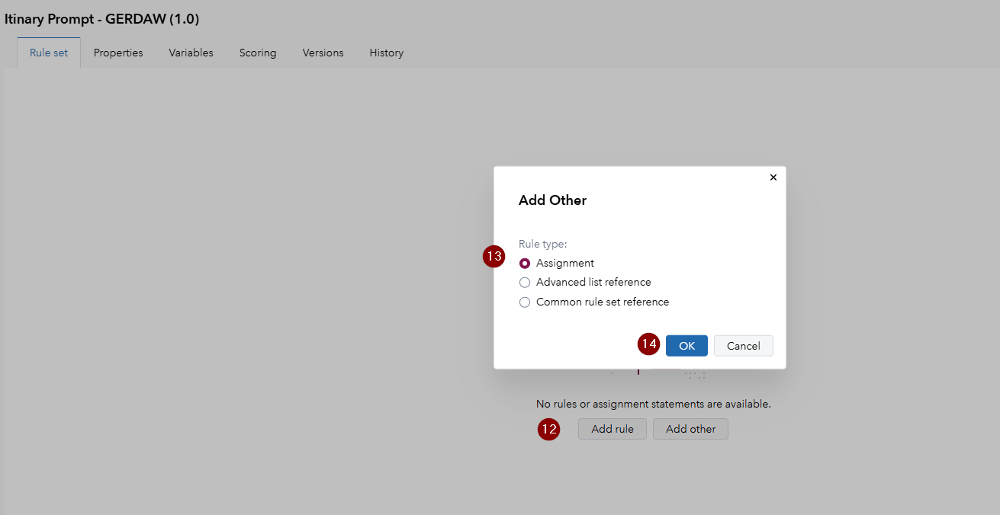

# Agentic Decisioning Powered by Intel’s Gaudi

This use case walks through how to create a small agent with SAS Intelligent Decisioning that helps an amusement park visitor build an itinary. For this you will be using a pre generated output from the optimization model and have to develop a prompt that will turn the insights of the model into something that an amusement park visitor can understand.

## Objective

**Create a decision in SAS Intelligent Decisioning that provides a readable itinerary from the provided model output using an LLM that is hosted on Intel's Gaudi hardware.**

## Additional Data

Here the mode output and a translation table for the attraction IDs that our model outputs are provided:

### Model Output

The output is provided as 9 different variables, where three represent one line output of the model:

attractionID_1: '756f722e7573662e72696465732e726163655f7468726f7567685f6e65775f796f726b5f7374617272696e675f6a696d6d795f66616c6c6f6e5f7374616e646279'

timestamp_1: '06MAY2025:10:25:00'

walking_distance_1: '100m'

attractionID_2: '756f722e7573662e72696465732e726163655f7468726f7567685f6e65775f796f726b5f7374617272696e675f6a696d6d795f66616c6c6f6e5f7374616e646279'

timestamp_2: '06MAY2025:10:55:00'

walking_distance_2: '300m'

attractionID_3: '756f722e7573662e72696465732e666173745f616e645f667572696f75735f2d5f7375706572636861726765645f7374616e646279'

timestamp_3: '06MAY2025:11:32:00'

walking_distance_3: '250m'

### Attraction LoopUp Table

Here is table that contains the look up values for the attraction IDs and the attraction names:

| Attraction ID                                                | Attraction Name           |
| ------------------------------------------------------------ | ------------------------- |
| 756f722e7573662e72696465732e726163655f7468726f7567685f6e65775f796f726b5f7374617272696e675f6a696d6d795f66616c6c6f6e5f7374616e646279 | Late Night Dash           |
| 756f722e7573662e72696465732e68617272795f706f747465725f616e645f7468655f6573636170655f66726f6d5f6772696e676f7474735f7374616e646279 | Escape from Magical Bank  |
| 756f722e7573662e72696465732e666173745f616e645f667572696f75735f2d5f7375706572636861726765645f7374616e646279 | Nitro Street: Turbo Chase |


## Guided Instructions

If you want to explore this use case on your own please do not read on, here a step-by-step guide is provided to help you walk through everything.

1.   Navigate to SAS Intelligent Decisioning via the *Build Decisions* entry in the main menu.

2.   Click *New decision*, provide a name to the decision and ensure that its *Location* is set to *Public*.
     

3.   In the decision click on the *Objects* pane and drag & drop the *LLM powered by Intel Gaudi* node onto the *Start* node.

4.   Next click on the *More* menu icon and select *Add missing variables*, in the dialogue click *OK*.
     

5.   Click the *Save* icon to save these changes.

6.   From the *Objects* pane drag and drop a *Rule Set* onto the *Start* node. Give it a name and ensure that its *Location* is set to *Public*.
     

7.   Click the *Rule set editor Open* button in the *Properties* pane that just opened up.

8.   In the *Variables* tab of the rule set click on *Add variable* and select *Custom variable*.

9.   In the *Add Variables* pop up enter the following values:

     | Name               | Data Type | Length | Input | Output |
     | ------------------ | --------- | ------ | ----- | ------ |
     | systemPrompt       | Character | 10240  |       | Yes    |
     | userPrompt         | Character | 10240  |       | Yes    |
     | attractionID_1     | Character |        | Yes   |        |
     | attractionID_2     | Character |        | Yes   |        |
     | attractionID_3     | Character |        | Yes   |        |
     | timestamp_1        | Character |        | Yes   |        |
     | timestamp_2        | Character |        | Yes   |        |
     | timestamp_3        | Character |        | Yes   |        |
     | walking_distance_1 | Character |        | Yes   |        |
     | walking_distance_2 | Character |        | Yes   |        |
     | walking_distance_3 | Character |        | Yes   |        |

10.   The *Variables* tab should look like this:
      

11.   Switch to the *Rule set* tab and click on the *Add other* button, in the pop up select *Rule type: Assignment* and click *OK*.
      

12.   Set the assign for systemPrompt and enclose your system prompt that will help to translate the model output into something that an amusement park visitor can understand.

13.   Click the *Add* button in the right-hand corner and select *Add assignment*.
      

14.   Click the *Edit* button and now in the *Expression Editor: Default_assignment_2* you can copy and paste the following string which concatenates the model outputs into one string which is assigned to the user prompt which will be sent to the LLM:

      ```SAS
      userPrompt = CATX(';', 'attractionID_1: ', attractionID_1, 'timestamp_1: ', timestamp_1, 'walking_distance_1: ', walking_distance_1, 'attractionID_2: ', attractionID_2, 'timestamp_2: ', timestamp_2, 'walking_distance_2: ', walking_distance_2, 'attractionID_3: ', attractionID_3, 'timestamp_3: ', timestamp_3, 'walking_distance_3: ', walking_distance_3) 
      ```

      Click the *Verify syntax* button to ensure that everything was copied correctly and click *Save*.
      

15.   Save the rule set and return to the decision.

16.   Repeat the adding of the missing variables from step 4 and click *Save*.

17.   Switch to the *Scoring* tab and then in the *Scoring* tab select the *Scenarios* tab.
      

18.   There click on *New test*, ensure that the *Location* is set to *Public* and set the *Output table location* to *Public*. Then enter the values from the *Output data* section (don't forget to enclose the values in single quotes) and click *Save*.
      

19.   Finally select the scenario, click the *Run* button, review the results and discuss them with the people at the station.
      
