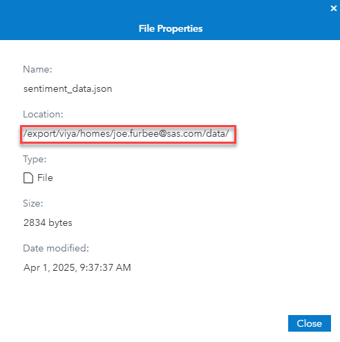

# Sentiment Analysis With SAS

## Description  
This use case walks through a sentiment analysis of text strings use case. Participants will access a Jupyter notebook and run through a series of commands that will load data, create a sentiment model, score the model, and then process the results in SAS Studio. To complete the task, hackers will be asked a series of questions about the resulting data set.

## Objectives  
•	Create a data set and apply the sentiment Text Anlytics Models through REST requests using the sentimentAnalysis.applySent CAS action.  
•	Analyze the results in SAS Studio
Step-by-step instructions
1.	Download the Jupyter notebook for the use case from https://github.com/sascommunities/sas-hackathon-boot-camp-2025/blob/main/sentiment/text-analytics-sentiment-hack.ipynb.
2.	Log into the Jupyter environment at https://\<viyaserverurl\>/hub.
3.	Upload the notebook downloaded earlier into the /data directory.  


4.	Open a terminal session.  


5.	Run the following command to get an access token.  
```echo $ACCESS_TOKEN```
6.	Copy the value of the token.
7.	Fill in the first cell of the notebook with the SAS Viya URL and the ACCESS_TOKEN value.  


8.	Step through the notebook, noting the comments in the commands and the resulting output.
9.	The final result of the notebook runs is an output file titled sentiment_data.json. It will be written to the /data directory. This will be visible in SAS Studio.  


11.	Open the SAS Viya environment using the provided URL. 
12.	From the Applications menu (3x3 squares icon in the upper left-hand corner), navigate to Develop Code and Flows.  

13. In the left navigation bar select the second icon and follow the path SAS Server-> Home-> data.   

14. Right-click on the sentiment_data file and access Properties.    

15.	Copy the path.
16.	Create a new SAS code window and enter the following code: libname hack json \<path to the file copied from the previous step\>/sentiment_data.
17.	In the left nav window, go to the Libraries tab and expand the HACK library.  

18.	Double click on the FETCH_ROWS entry.
19.	Answer the following questions:  
a. From the element3 column, how many sentiments are positive, neutral, and negative?  
b.	What is the highest sentiment score?  
c.	What is the lowest sentiment score?  
